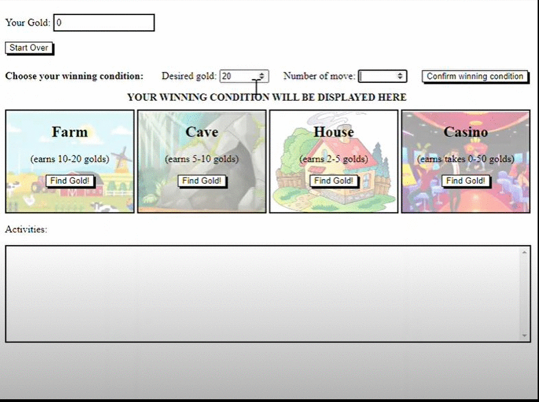

# Python_Ninja_gold
This is a mini-game that helps a ninja make some money.
When the game is started, ninja has 0 gold. The ninja can go to different places (farm, cave, house, casino) and earn different amounts of gold. In the case of a casino, ninja can earn or lose up to 50 gold. The activities box is to display past activities of this ninja.

